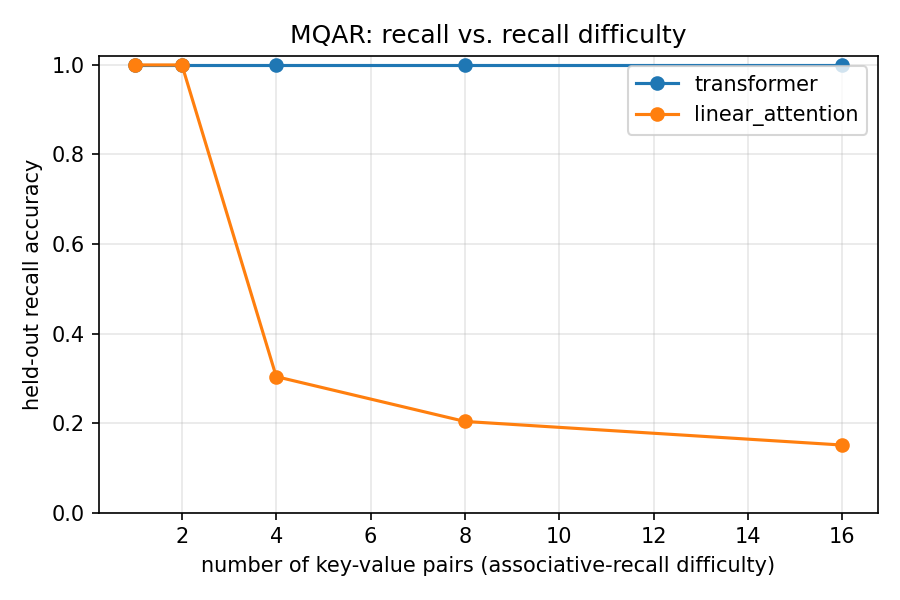
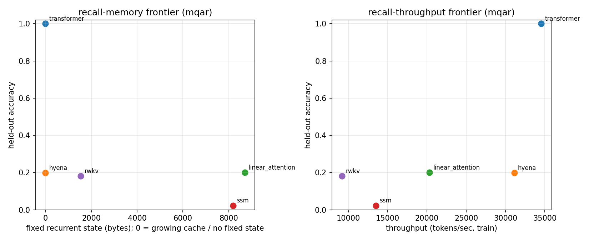
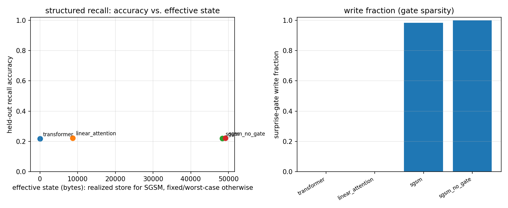

# LCMVRSI

[](https://github.com/ruufaayl/LCMVRSI/actions/workflows/ci.yml)
[](https://github.com/ruufaayl/LCMVRSI/actions/workflows/paper.yml)


**Long-Context Memory, Verifiable Reasoning, and Scalable Intelligence** — a research
scaffold for studying the **recall–memory tradeoff** in subquadratic sequence models.
Six architectures and five synthetic recall tasks on one tested interface, a **proven**
recall–state lower bound, and an honestly-reported attempt at a novel memory mechanism.

> **Honesty discipline.** Every non-trivial claim in this repo and the paper is tagged
> **[PROVEN]**, **[EMPIRICAL]**, or **[CONJECTURE]**. No fabricated theorems, citations,
> or results. References enter `paper/refs.bib` only after verification.

## What this is
A runnable, tested comparison of sequence-model architectures on synthetic recall tasks,
plus an honest attempt at a novel result: a **proven** lower bound (an *entropy floor*) linking
recall capacity to recurrent state size, and a **surprise-gated sparse-memory** mechanism whose
first experiment is an honest **negative** result (see `docs/theory`, `docs/mechanism`). See
[`docs/superpowers/specs/2026-05-29-lcmvrsi-design.md`](docs/superpowers/specs/2026-05-29-lcmvrsi-design.md).

**Models** (all conform to one `SequenceModel` interface and self-report `state_size`/`complexity`):

| Model | Time | Fixed recurrent state |
|---|---|---|
| `transformer` | `O(T² d)` | none (growing KV cache) |
| `hyena` (gated FFT long conv) | `O(T log T · d)` | none (O(T) history) |
| `linear_attention` | `O(T d²)` | `O(d²)` |
| `ssm` (diagonal S4D-style) | `O(T d N)` | `O(d N)` |
| `rwkv` (WKV recurrence) | `O(T d)` | `O(d)` |
| `sgsm` (surprise-gated memory, **H2**) | `O(T² d)` train | grows with surprise (≤ `O(T)`) |

**Tasks** (`SequenceModel`-agnostic, recall is supervised only at query positions): `mqar`
(multi-query associative recall), `copying`, `induction` (induction-head), `needle`
(needle-in-a-haystack), and `structured_recall` (predictable cyclic filler + sparse novel
bindings; the H2 testbed). The subquadratic/fixed-state models are simplified, honestly-named
baselines — not the original authors' full kernels.

## Results
Every figure is reproducible via the [Experiments](#experiments) commands. Single-seed and
small-scale by design (see the paper's Limitations) — values are indicative, not definitive.

**1 · The recall wall (MQAR).** As the number of key→value pairs grows, the transformer (growing
cache) holds at ~100% recall while linear attention collapses — the fixed-state bottleneck made
visible. *[EMPIRICAL]*



**2 · The recall–memory frontier (five architectures).** Only the content-addressed transformer
solves MQAR; fixed-state and content-independent models sit near chance *regardless of state
budget*. Two non-obvious reads: a non-selective SSM is ≈chance (the gap Mamba's selectivity
targets), and Hyena fails *despite no fixed state* — so content-based addressing is an orthogonal
requirement the Ω(n) bound doesn't capture. *[EMPIRICAL]*



**3 · H2 mechanism — an honest negative.** Our surprise-gated memory (`sgsm`) did **not** sparsify
under recall-only supervision (it wrote ~98% of tokens), so it matched rather than beat the
baselines. The diagnosed cause (no language-model signal on the filler) and the fix (an auxiliary
next-token loss) are documented in [`docs/mechanism`](docs/mechanism/README.md). *[EMPIRICAL, negative]*



## Quickstart
```bash
# install uv: https://docs.astral.sh/uv/
uv sync --group dev      # create .venv and install deps + dev tools
uv run pytest            # run the test suite
uv run ruff check .      # lint
```
GPU note: `uv sync` installs the CPU build of PyTorch by default. For your CUDA GPU,
install the matching CUDA wheel per https://pytorch.org/get-started/locally/.

## Experiments
Tiny by default — every command below runs on CPU in minutes.
```bash
# Train one model on MQAR from a YAML config; writes a self-describing result JSON to results/
uv run python experiments/run.py -c configs/base.yaml

# Recall–memory sweep: held-out recall vs. number of key–value pairs, per architecture.
# Writes results/recall_sweep_summary.json (committed), per-run JSONs (results/runs/, gitignored),
# and the figure results/figures/recall_vs_pairs.png (committed).
uv run --extra viz python experiments/sweep_recall.py

# Recall–memory / recall–throughput frontier across ALL models on one task at fixed difficulty.
# Writes results/frontier_<task>.json + results/figures/frontier_<task>.png.
uv run --extra viz python experiments/frontier.py --benchmark mqar

# H2 achievability test: SGSM vs baselines + gate ablation on the structured-recall task.
# Writes results/h2_structured_recall.json + results/figures/h2_structured_recall.png.
uv run --extra viz python experiments/h2_compare.py

# Complexity/memory table, generated from the live models (cross-checks docs/architecture-review):
uv run python experiments/complexity_table.py -o results/complexity_table.md

# Interactive dashboard over results/ (needs the viz extra):
uv run --extra viz streamlit run dashboard/app.py
```
Each result JSON records the config, the model's `complexity()`/`state_size`, the training
curve and throughput, held-out recall, and the software environment (incl. git commit) — so
every number is reproducible and traceable.

## Layout
- `src/lcmvrsi/` — package: `models/`, `benchmarks/`, `train/` (runner, sweep, LR schedule),
  `viz/`, `utils/`, `analysis.py` (complexity table)
- `configs/` — YAML experiment configs (tiny-by-default; scale-up provided later)
- `experiments/` — CLIs: `run.py`, `sweep_recall.py`, `frontier.py`, `h2_compare.py`, `complexity_table.py`
- `dashboard/` — Streamlit app over `results/`
- `results/` — outputs: committed summary JSON + `figures/`; raw per-run JSONs in `runs/` (gitignored)
- `paper/` — LaTeX sources; PDF built by CI
- `docs/` — knowledge map, architecture review, problem formalization

## Status
Milestone **M4 (novel contribution)** — H1 *entropy-floor* lower bound **[PROVEN]** (`docs/theory`,
paper §Theoretical Analysis); H2 surprise-gated memory (`sgsm`) implemented and tested, with an
honest **negative** first result (the gate did not sparsify under recall-only supervision —
`docs/mechanism`). Paper has theory, experimental-setup, and results/limitations sections.
Roadmap M0→M5 in the design spec.
